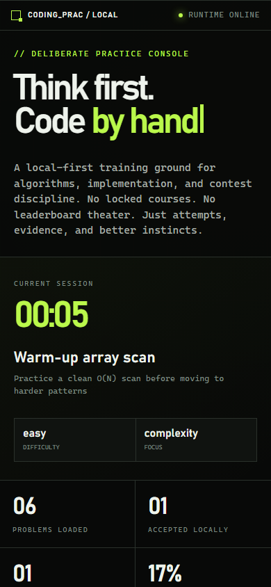

<div align="center">

# coding_prac

**think first. code by hand.**

A local-first practice console for algorithms, implementation, and contest discipline.

[Quick start](#quick-start) · [Workflow](#core-workflow) · [Research](docs/RESEARCH.md) · [Roadmap](docs/ROADMAP.md) · [Contributing](CONTRIBUTING.md)

[](LICENSE)


</div>


The first release focuses on the shortest useful loop:

```text
pick a problem -> code by hand -> run local tests -> inspect failure -> review -> repeat
```

There are no locked courses. Topics, problems, links, solutions, and practice tracks remain yours. AI can coach during preparation, while `contest mode` hard-blocks AI commands for rule-restricted practice and official contests.

<details>
<summary>Responsive local dashboard</summary>

<p align="center"></p>

</details>

## Requirements

- Node.js 20.11+
- `g++` for C++20 problems
- Optional: Python 3 for Python problems
- Optional: an OpenAI-compatible or Anthropic API key for coaching/research

## Quick start

```bash
npm install
npm run build
npm link
prac init --codetour
prac doctor
```

Or run without linking:

```bash
npm run dev -- init --codetour
npm run dev -- status
```

## Core workflow

```bash
# Explore the editable starter track
prac problem list
prac problem show threshold-homework

# Code by hand in solutions/threshold-homework.cpp, then judge locally
prac session start threshold-homework --goal "recognize sort + prefix + upper_bound"
prac judge threshold-homework
prac session finish --note "forgot duplicate thresholds"

# Add anything you want to learn
prac topic add "Dynamic programming" --description "state, transition, proof"
prac problem create "Coin change" --topic dynamic-programming --difficulty medium
prac problem add-test coin-change --input sample.in --output sample.out

# Optional local read-only dashboard
prac serve
```

## AI coaching and provider setup

Copy `.env.example` values into your shell environment. Secrets are never written to `.prac/state.json`.

```bash
export PRAC_AI_PROVIDER=openai-compatible
export PRAC_AI_BASE_URL=https://api.openai.com/v1
export PRAC_AI_MODEL=gpt-5-mini
export PRAC_AI_API_KEY=...

prac coach hint threshold-homework --level 1 --attempt "I think sorting may help"
prac coach review threshold-homework
```

OpenAI-compatible endpoints make local gateways and many hosted providers usable without adding provider-specific code. Anthropic's Messages API is also supported directly.

### Contest-safe switch

```bash
prac contest on    # coach/research AI calls fail closed
prac contest status
prac contest off
```

For Code Tour 2026, the official rules prohibit AI tools during official rounds. Contest mode is only a guardrail; you remain responsible for closing other AI tools and following the current official rules.

## Turn a public link into a study brief

```bash
prac research https://example.com/job-or-contest \
  --goal "Find the knowledge and drills needed to prepare"

# Capture metadata only, without an AI call
prac research https://example.com/event --no-ai
```

The generated brief is saved under `research/`. Web content is treated as untrusted reference text, not as instructions to the AI.

## Commands

```text
prac init [--codetour]
prac status
prac doctor
prac topic add|list
prac problem create|add-test|list|show
prac judge <problem-id>
prac session start|finish
prac track install codetour
prac contest on|off|status
prac coach hint|review
prac research <url>
prac serve
```

## Local data and trust boundary

- `.prac/state.json`: local progress and attempts (gitignored)
- `.prac/sessions.md`: local session log (gitignored)
- `solutions/`: editable code (tracked if you choose)
- `tracks/`: editable study tracks
- `research/`: generated study briefs

`prac judge` executes solution code on your machine. It has a timeout but **is not a security sandbox**. Run only code you trust. A container/WSL sandbox is intentionally deferred until the core practice loop proves useful.

## Development

```bash
npm run check
```

Architecture and product decisions are documented in [`docs/RESEARCH.md`](docs/RESEARCH.md) and the next steps in [`docs/ROADMAP.md`](docs/ROADMAP.md).

Contributions are welcome. Read [`CONTRIBUTING.md`](CONTRIBUTING.md) before opening a pull request.

## License

Apache-2.0 — see [`LICENSE`](LICENSE).
