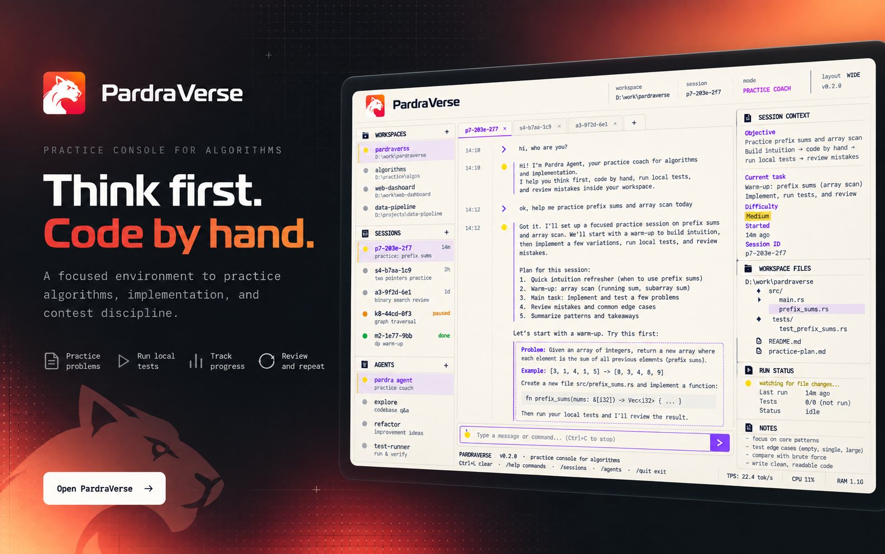
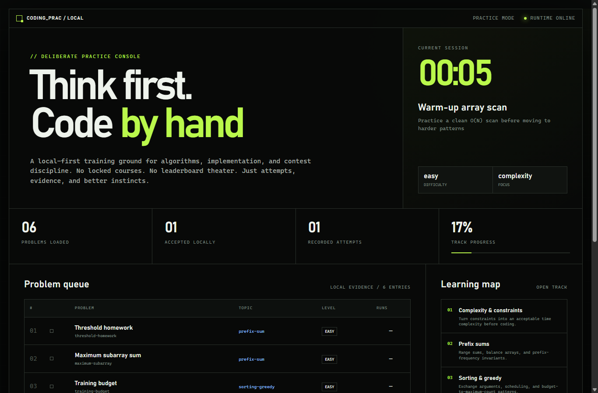

<div align="center">


**A local coding-learning agent for the terminal.**

PardraVerse helps you think first and code by hand. Talk through what you want to practice, while the local agent manages problems, solution files, tests, judging, research, and session history behind one conversational workspace.

[Quick start](#quick-start) · [How it works](#how-it-works) · [Architecture](docs/RESEARCH.md) · [Contributing](CONTRIBUTING.md)

[](LICENSE)


</div>



## Quick start

```bash
npm install
npm run build
npm link
prac init
prac
```

Inside the terminal, ask naturally:

```text
Show my progress and suggest what to practice next.
Create an arrays problem in JavaScript with two sample cases.
Start a 30-minute session for reachability.
Run my solution and explain the first failure without rewriting my code.
Research this public link and save an editable study note: https://example.com
```

No provider key is required for local status, problem browsing, or judging. AI coaching and workspace changes need a configured provider:

```bash
export PRAC_AI_PROVIDER=openai-compatible
export PRAC_AI_BASE_URL=https://api.openai.com/v1
export PRAC_AI_MODEL=gpt-5-mini
export PRAC_AI_API_KEY=...
```

Anthropic's Messages API is also supported; see [`.env.example`](.env.example).

## How it works

The default `prac` command opens a full-screen conversation. The model does not receive a general shell. It gets a narrow set of practice tools for inspecting progress, creating topics and problems, reading or updating one solution, running saved tests, managing focused sessions, and fetching bounded public pages.

```text
┌─ coding_prac ──────────────────────────────────────────────────┐
│                                                               │
│  ◇ you                                                        │
│    Run my current solution and help me understand the failure.│
│                                                               │
│  ◆ coding_prac                                                │
│    ↳ judge problem                                      done  │
│    The second case fails when duplicate values are present…   │
│                                                               │
├───────────────────────────────────────────────────────────────┤
│  Write a message…                                             │
├───────────────────────────────────────────────────────────────┤
│  openai-compatible / gpt-5-mini · local workspace             │
└───────────────────────────────────────────────────────────────┘
```

The teaching policy is deliberate by default:

- ask about the learner's attempt before solving;
- progress from directional hints to patterns to pseudocode;
- write complete solutions only after an explicit request;
- distinguish actual judge evidence from explanation;
- keep arbitrary topics and imported problems first-class;
- block AI interaction when contest mode is active.

## Durable local workspace

All personal runtime data stays under `.prac/` and is gitignored:

- `.prac/state.json` — topics, problems, attempts, and active session
- `.prac/chat/current.json` — restorable conversation
- `.prac/chat/archive/` — previous conversations
- `.prac/events.jsonl` — append-only lifecycle and tool events
- `.prac/sessions.md` — finished-session reflections

Solution files live under `solutions/`; generated study notes live under `research/`. Both remain ordinary editable files.

## Local judging

C++20, Python, and JavaScript are supported. A judge run compiles or executes the selected solution, compares normalized output, records timing and verdicts, and returns the evidence to the conversation.

The runner has a wall-clock timeout but **is not a security sandbox**. Run only code you trust. It does not isolate the filesystem, network, memory, or child processes.

## Contest lock

```bash
prac contest on
prac contest off
```

When the lock is on, the conversational UI falls back to deterministic local-only actions and no AI request is created. The lock cannot control other editors, terminals, or applications; follow the applicable rules yourself.

## Optional web view

The optional web workspace stays compact and read-only:



```bash
prac serve
```

The web surface is a small, read-only view of the same local state. It does not duplicate creation, editing, or judging workflows from the terminal.

## Automation commands

Conversation is the primary interface. Explicit commands remain available for scripts, CI, and recovery:

```text
prac chat
prac init
prac status
prac doctor
prac topic add|list
prac problem create|add-test|list|show
prac judge <problem-id>
prac session start|finish
prac contest on|off|status
prac coach hint|review
prac research <url>
prac serve
```

## Development

Requires Node.js 22.19 or newer. C++ judging also needs `g++`; Python judging needs Python 3.

```bash
npm install
npm run check
npm audit --audit-level=low
```

The implementation adapts terminal-agent patterns from Pi, Codex, Grok Build, and Herdr without copying their branding or turning this project into a general autonomous coding agent. See [`docs/RESEARCH.md`](docs/RESEARCH.md) for the boundaries and [`docs/ROADMAP.md`](docs/ROADMAP.md) for incremental next steps.

## License

Apache-2.0 — see [`LICENSE`](LICENSE).
